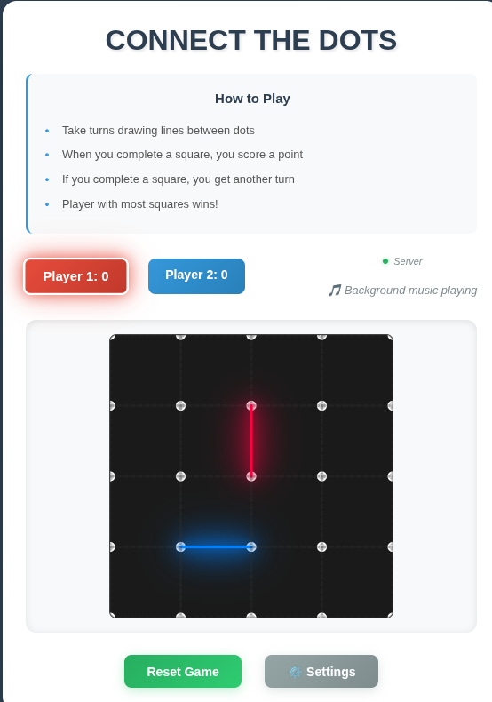
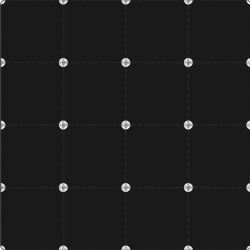
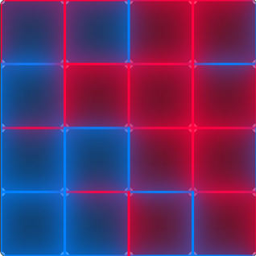
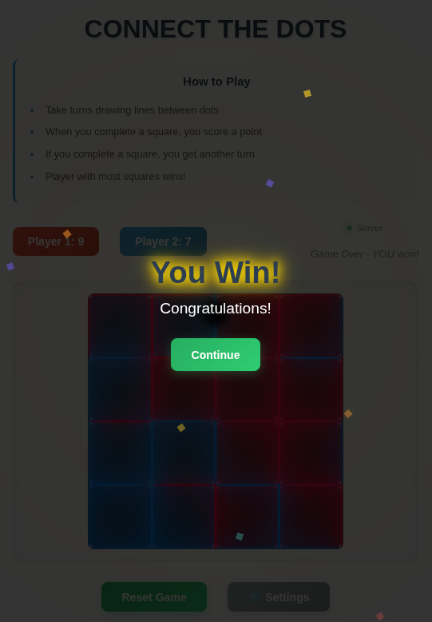
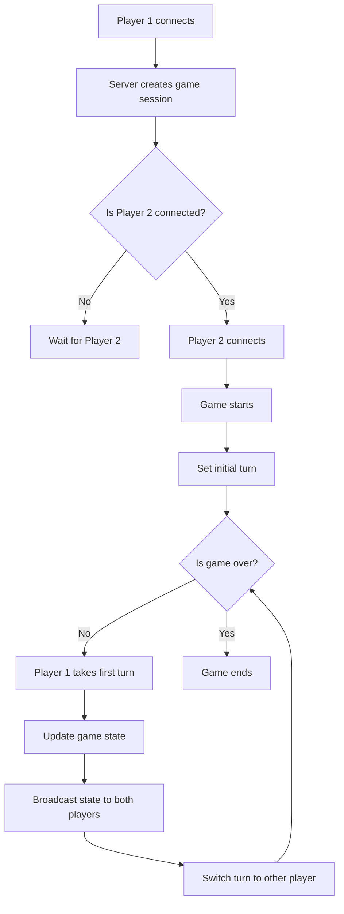

# Realtime Cooperative Game Prototype

A prototype of a real-time multiplayer game built with WebSocket technology for instant synchronization between players.

## 🎮 Connect The Dots

A classic strategy game where players take turns drawing lines between dots to complete squares and score points.

**Features:**

- Real-time multiplayer gameplay
- Turn-based system with scoring
- Responsive design (desktop & mobile)
- Visual feedback for player moves
- Background music and sound controls
- Game reset functionality

## 🔮 Future Enhancements

- [ ] Multiple game modes (3x3, 4x4, 6x6 grids)
- [ ] AI opponent for single-player
- [ ] Player statistics and game history
- [ ] Custom player names and avatars
- [ ] Tournament mode
- [ ] Spectator mode
- [ ] Game replay system
- [ ] Additional cooperative games

## Game Environment

### The main screen



### Board State at the beginning



### Board possible state at the end



### When you win



## 🚀 Quick Start

### Prerequisites

- Node.js (v14 or higher)
- pnpm (recommended) or npm

### Installation/Development

1. Clone the repository:

```bash
git clone --depth 1  https://github.com/miladtsx/realtime_coop_prototype
cd realtime_coop_prototype
```

2. Install dependencies:

```bash
pnpm install
# or
npm install
```

3. Start the server:

```bash
pnpm start
# or
npm start
```

4. Now the backend server is up and running; to test, open your browser and navigate to `http://localhost:3000`

5. Now you should open your file explorer and navigate to the `docs` and open [index.html](./docs/index.html) inside your browser. it should connect to the backend server address specified as the [BACKEND_WS_URL](./docs/dots-lines.js#L2).

6. Open another instance of the game in a new browser tab or window to start playing the game.

For development with auto-restart:

```bash
pnpm run dev
# or
npm run dev
```

## 🏗️ Project Structure

```
realtime_coop_prototype/
├── backend/
│   └── index.js              # WebSocket server & game logic
├── docs/
│   ├── index.html           # Game interface
│   ├── dots-lines.js        # Client-side game logic
│   ├── dots-lines.css       # Styling & responsive design
│   └── background*.mp3      # Audio files
├── package.json             # Dependencies & scripts
└── README.md               # This file
```

## Multiplayer Flowchart



## 🔧 Technical Stack

### Backend

- **Node.js + Express**: Web server
- **WebSocket (ws)**: Real-time bidirectional communication
- **CORS**: Cross-origin resource sharing
- **dotenv**: Environment variable management

### Frontend

- **HTML5 SVG**: Game board rendering
- **Vanilla JavaScript**: Game logic & WebSocket client
- **CSS3**: Modern styling with responsive design
- **Web Audio API**: Background music support

## 🎯 How to Play Connect The Dots

1. **Objective**: Complete more squares than your opponent
2. **Gameplay**:
   - Players take turns clicking dashed lines between dots
   - Complete a square by drawing all 4 sides
   - Completing a square scores a point and grants another turn
   - Game ends when all squares are completed
3. **Winner**: Player with the most completed squares

## 🌐 WebSocket API

### Client Messages

- `{ type: "join", game: "dots-lines" }` - Join game queue
- `{ type: "move", game: "dots-lines", lineId: "horizontal-1-2", player: 1 }` - Make move
- `{ type: "reset", game: "dots-lines" }` - Reset current game

### Server Messages

- `{ type: "player-assigned", playerId: 1, gameId: "abc123" }` - Player assignment
- `{ type: "game-start" }` - Game begins
- `{ type: "move-made", lineId: "horizontal-1-2", player: 1, completedSquares: [], scores: {1: 0, 2: 0}, currentPlayer: 2 }` - Move broadcast
- `{ type: "game-reset" }` - Game reset notification
- `{ type: "player-disconnected" }` - Opponent disconnected

## 📱 Responsive Design

- **Desktop**: Full game interface with detailed player statistics
- **Mobile**: Compact view optimized for touch interaction
- **Cross-browser**: Compatible with modern web browsers

## 🎵 Audio Features

- Background music with volume control
- Music toggle on/off
- Persistent settings using localStorage

## 🔒 Environment Variables

Create a `.env` file for configuration:

```
PORT=3000
```

## 🚀 Deployment

### Production Setup

1. Set environment variables:

```bash
export NODE_ENV=production
export PORT=3000
```

2. Start the server:

```bash
node backend/index.js
```

### Docker (Optional)

```dockerfile
FROM node:18-alpine
WORKDIR /app
COPY package*.json ./
RUN npm install --production
COPY . .
EXPOSE 3000
CMD ["node", "backend/index.js"]
```

### Code Structure

- **Game State Management**: Server-side validation and state tracking
- **Real-time Sync**: WebSocket broadcasts for instant updates
- **Turn Management**: Server-enforced turn validation
- **Disconnection Handling**: Graceful cleanup and notification

## 🐛 Troubleshooting

### Common Issues

1. **Connection Failed**: Check if server is running on correct port
2. **Players Not Syncing**: Verify WebSocket connection status
3. **Game Not Starting**: Ensure both players have joined
4. **Audio Not Playing**: Check browser audio permissions

## 📄 License

ISC License - see package.json for details

---

**Ready to play?** Start the server and challenge a friend to a game of Connect The Dots!
